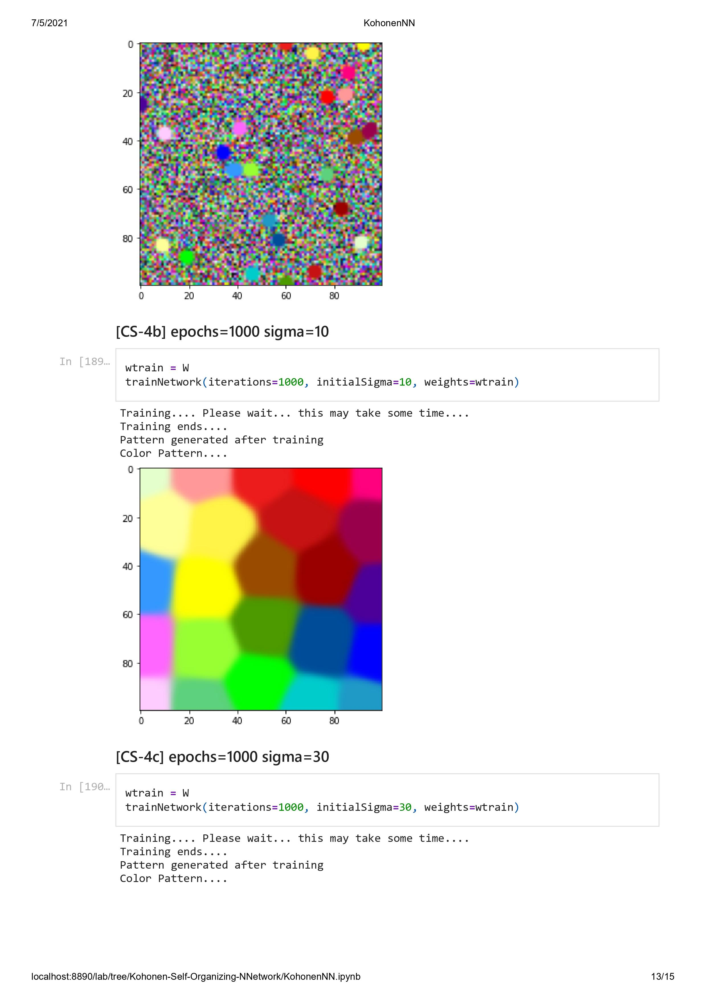

# Kohonen-Self-Organizing-NNetwork
## This Repository explains the mechanism of Kohonen's Self Organizing Neural Network Taking example of Unsupervised RGB Color Classification

#### A self-organizing map (SOM) or self-organizing feature map (SOFM) is a type of artificial neural network (ANN) that is trained using unsupervised learning to produce a low-dimensional (typically two-dimensional), discretized representation of the input space of the training samples, called a map, and is therefore a method to do dimensionality reduction. Self-organizing maps differ from other artificial neural networks as they apply competitive learning as opposed to error-correction learning (such as backpropagation with gradient descent), and in the sense that they use a neighborhood function to preserve the topological properties of the input space.
 

### Implementation Details:
#### The map is a 100 x 100 grid of neurons each containing a weight vector corresponding to its RGB value. The neuron weights are randomly initialized using the computer's clock time as a seed. Training involves randomly selecting an input from one of 24 unique colors, finding a "winning" neuron using Euclidean distance, and adjusting the "neighborhood" weights. I used a Gaussian function whose amplitude and radius decrease as the number of epochs increases to determine how much to adjust the "neighborhood" weights. Because the neuron weights are randomly initialized, the map converges differently each time. Sometimes the map converges quickly and elegantly while othertimes the map has difficulty in reaching stable equilibrium or filling in the gaps between clusters.
 

 

